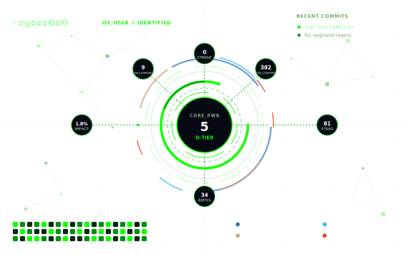

# GitBoard

GitBoard generates a **live-updating SVG dashboard** for your GitHub profile README.

It:
- Pulls public GitHub stats for a user (stars, followers, repos, contributions, etc.)
- Computes **Core Power**, **Impact**, and **Tier**
- Renders an SVG using a template from `templates/`
- Saves the final SVG to `assets/my_dashboard.svg`
- Injects the SVG image into your profile `README.md` between markers

---

## Quick Start (GitHub Profile README)

GitHub profile READMEs live in a special repository named exactly your username:

- If your username is `LegedsDaD`, your profile README repo is: `LegedsDaD/LegedsDaD`

### 1) Add markers to your profile `README.md`

Put these comments on their own lines wherever you want the dashboard to appear:

```md
<!-- Gitboard Start -->

<!-- Gitboard End -->
```

GitBoard will replace everything between them with:

```md

```

### 2) Add the workflow to your profile repo

Create this file in your profile repo:

- `.github/workflows/gitboard.yml`

```yml
name: GitBoard
on:
  workflow_dispatch:
  schedule:
    - cron: "0 0 * * *"

permissions:
  contents: write

jobs:
  build:
    runs-on: ubuntu-latest
    steps:
      - uses: actions/checkout@v4

      - name: Generate dashboard
        uses: LegedsDaD/GitBoard@main
        with:
          username: LegedsDaD
          template: Quantum Forge
          theme: dark
          output: assets/my_dashboard.svg
          readme: README.md
          prefer_txt: "true"

      - name: Commit changes
        run: |
          if git diff --quiet; then
            echo "No changes."
            exit 0
          fi
          git config user.name "github-actions[bot]"
          git config user.email "github-actions[bot]@users.noreply.github.com"
          git add assets/my_dashboard.svg README.md
          git commit -m "Update GitBoard dashboard"
          git push
```

### 3) Run it

Go to your profile repo → **Actions** → **GitBoard** → **Run workflow**.

The workflow commits updates back to your repo (updates `assets/my_dashboard.svg` and `README.md`).

---

## Templates

Templates live in `templates/` (multiple themes/variants). GitBoard replaces placeholders like:

- `{{USERNAME}}` → your username
- `{{CORE_POWER}}` → computed Core Power (0–100, integer)
- `{{IMPACT}}` → computed Impact (0–100, rendered as percent string like `84.2%`)
- `{{TIER}}` → tier label (e.g. `A-TIER`, `S-TIER`, `Ω-TIER`)
- `{{FOLLOWERS}}` → follower count (integer)
- `{{FOLLOWING}}` → label placeholder (templates typically show it as a label, not a numeric stat)
- `{{STREAK}}` → current contribution streak (days)
- `{{REPOS}}` → public repository count
- `{{STARS}}` → total stars across public repos
- `{{LANG1_LINE}}` → top language line (example: `Python - 52%`)
- `{{LANG2_LINE}}` → 2nd top language line
- `{{LANG3_LINE}}` → 3rd top language line
- `{{LANG4_LINE}}` → 4th top language line

### Picking a template

In workflows, set:
- `template`: a template folder name (e.g. `Quantum Forge`, `PulseGrid`, `Neon Reactor`, `Devcore OS`, `Eclipse Nexus`)
- `theme`: `dark` or `light`

---

## CLI Usage (Local / Debugging)

Run locally (best with a token to avoid rate limits):

```bash
export GITHUB_TOKEN=...   # or set GH_TOKEN
python gitboard.py --username LegedsDaD --template "Quantum Forge" --theme dark --prefer-txt
```

Outputs:
- `assets/my_dashboard.svg`
- Updates `README.md` between markers

---

## Metrics & Formulas

GitBoard computes normalized scores (0–100) and combines them using these formulas.

### Core Power

Measures overall engineering capability and activity strength.

$$
\\text{Core Power} =
0.25S +
0.20C +
0.15R +
0.15F +
0.10P +
0.10T +
0.05A
$$

Where:
- **S** = Stars score
- **C** = Commit activity score
- **R** = Repository quality score
- **F** = Followers score
- **P** = Pull request score
- **T** = Contribution streak score
- **A** = Activity consistency score

### Impact

Measures influence on the community and ecosystem.

$$
\\text{Impact} =
0.40S +
0.25F +
0.15K +
0.10M +
0.10I
$$

Where:
- **S** = Stars influence score
- **F** = Followers influence score
- **K** = Forks score
- **M** = Merged pull requests score
- **I** = Issues resolved score

### Tier (from Core Power)

Tier is derived from Core Power using thresholds:

| Core Power Range | Tier   |
| --- | --- |
| 0–19   | D-TIER |
| 20–39  | C-TIER |
| 40–59  | B-TIER |
| 60–74  | A-TIER |
| 75–89  | S-TIER |
| 90–100 | Ω-TIER |

### Activity Consistency (A)

$$
A = \\frac{\\text{Active Days}}{\\text{Total Days}} \\times 100
$$

### Contribution Streak Score (T)

$$
T = \\frac{\\text{Current Streak}}{365} \\times 100
$$

### Pull Request Score (P)

$$
P = 0.7m + 0.3o
$$

Where:
- **m** = merged PR score (normalized)
- **o** = opened PR score (normalized)

### Stars Score (S)

$$
S = \\frac{\\text{Total Stars}}{\\text{Max Star Threshold}} \\times 100
$$

### Followers Score (F)

$$
F = \\frac{\\text{Followers}}{\\text{Follower Threshold}} \\times 100
$$

---

## Tokens / Rate Limits

GitHub API calls are rate-limited. In GitHub Actions, `GITHUB_TOKEN` is provided automatically.

If you run locally without a token, GitBoard may fall back to partial/zero values when rate limited.
